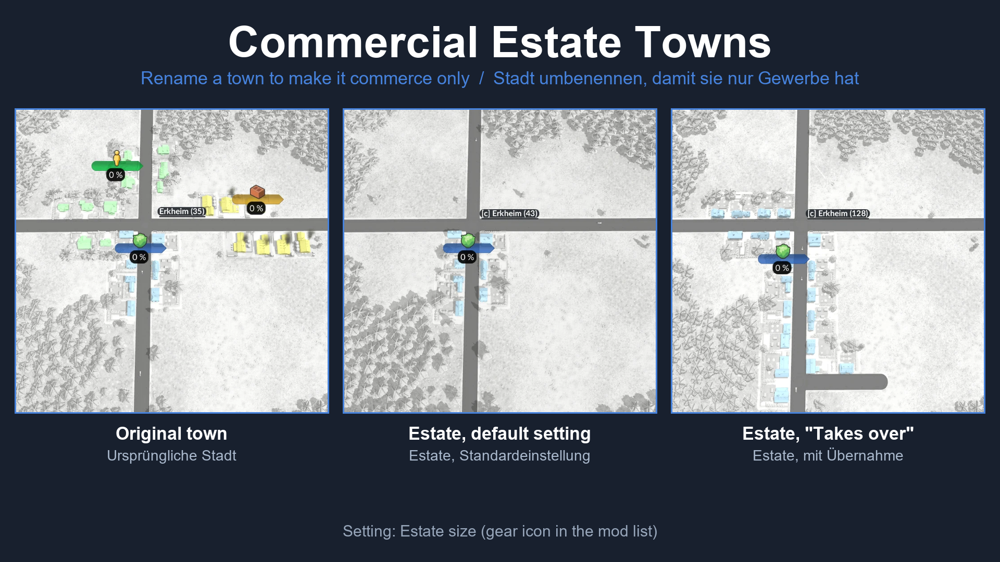

# Commercial Estate Towns (Transport Fever 3)

**EN** | [DE](#deutsch)

**Get it in the in-game Mod Hub** (mod.io): search for "Commercial Estate Towns".

A script mod for Transport Fever 3. Rename a town so that its name starts with a keyword, and the town becomes a **commercial estate**: no housing and industry, only commerce. Remove the keyword again and the town gets its housing and industry back. All other towns stay as they are.

**Please test it in a new game or on a copy of your savegame first, and tell me how it works for you** (see [Feedback](#feedback)).

## How to use

1. Open the town window and click the pencil to rename the town.
2. Start the new name with one of the keywords (case does not matter):

   | Keyword | Examples |
   |---|---|
   | `commerc` | `Commercial Centre`, `Commerce Park` |
   | `gewerbe` | `Gewerbegebiet Ost`, `gewerbe 3` |
   | `[c]`, `[com]`, `#com` | `[c] Harbour`, `[com]Nord`, `#com West` |

3. Within a few seconds the other buildings of that town are removed. Only the commerce buildings stay.
4. To turn it back into a normal town, remove the keyword from the name. The other zones return within seconds.

Only the **start** of the name counts. If the first letters of one of your towns happen to match a keyword, rename it.

## Setting: Estate size

In the mod settings (gear icon) you can choose how big the estate becomes:

- **As before (keep the small zone)**, the default: the commerce zone keeps its own size, so the town gets much smaller.
- **Takes over the space of the other two zones**: the commerce zone gets the space of all three zones of that town. The town keeps about its old size. The setting is read when the game starts, so change it before loading the game.

## What to expect

- The zone of an estate grows when you supply it, like in any town.
- When you remove the keyword, the town gets back the values it had before. If the mod did not know them (for example because the mod was switched off in between), the zones come back with the typical size of the other towns of the map (the median of every zone). If the map has no such town, a fixed ratio based on the commerce zone is used.
- If you switch the mod off, estates stay as they are. The game runs normally. If you switch the mod on again, a town that has neither housing nor industry and no keyword in its name is restored automatically.
- Industries on the map spawn as usual.

## Install

Open the **Mod Hub** in the game, search for "Commercial Estate Towns" and subscribe. Then start a game and activate the mod when you create it, or add it to an existing savegame (try a copy first). This repository holds the source code and is the place for feedback; the mod is meant to be installed through the Mod Hub.

## How it works

- `content/commercial_estate_towns.gs.lua` and `.script.tl`: a game script that checks the names of all towns every 5 seconds.
- For a town with a keyword it sets the initial land-use capacity of the other two zones to 0 (`makeTownSetInitialLandUseCapacitiesCmd`) and asks the town to update its buildings (`makeTownUpdateSizeCmd`). It remembers the original values in the script state, which is saved with the savegame. With the setting "Takes over", the kept zone gets the sum of capacity times size of all three zones.
- When the keyword is gone, it writes the remembered values back and lets the town rebuild.
- The game drops the script state when a savegame is loaded without the mod. Then the typical size of the towns of the map is used.
- The setting is handed from `mod.script.tl` to the game script in `baseConfig.locations.town.populationDensity`, which is not used after map generation.

## Tested

Tested on Transport Fever 3, build 40408, with a test savegame:
- Making a town an estate and back, with both settings.
- Estate size "Takes over": the zone is visibly bigger.
- Restoring without known original values (mod switched off in between): the town gets the median size of the map and looks right.
- Using the residential and the commercial estate mod together with different settings.
- Saving, quitting and loading again, with and without the mod.

Not tested: other mods that change town growth or town names, and very large maps.

## Feedback

Please use [Issues](../../issues) for bugs and [Discussions](../../discussions) for feedback and ideas. Helpful details: game build, other active mods, the name of the town, what you did before, and the `stdout.txt` from your `crash_dump` folder if the game crashed.

## License

MIT, see [LICENSE](LICENSE).

---

## Deutsch

**Im Spiel über den Mod-Hub laden** (mod.io): nach „Commercial Estate Towns“ suchen.

Ein Script-Mod für Transport Fever 3. Benenne eine Stadt so um, dass ihr Name mit einem Stichwort beginnt, und die Stadt wird zum **Gewerbegebiet**: nur noch Gewerbe, kein Rest. Entfernst du das Stichwort wieder, bekommt die Stadt Wohnen und Industrie zurück. Alle anderen Städte bleiben unverändert.

**Bitte zuerst in einem neuen Spiel oder mit einer Kopie deines Spielstands testen und mir Rückmeldung geben** (siehe [Feedback](#feedback-1)).

### So geht's

1. Das Stadtfenster öffnen und mit dem Stift die Stadt umbenennen.
2. Den neuen Namen mit einem der Stichwörter beginnen (Groß- und Kleinschreibung egal):

   | Stichwort | Beispiele |
   |---|---|
   | `commerc` | `Commercial Centre`, `Commerce Park` |
   | `gewerbe` | `Gewerbegebiet Ost`, `gewerbe 3` |
   | `[c]`, `[com]`, `#com` | `[c] Hafen`, `[com]Nord`, `#com West` |

3. Nach wenigen Sekunden sind die anderen Gebäude der Stadt abgebaut. Nur die Gewerbe-Gebäude bleiben.
4. Um wieder eine normale Stadt zu bekommen, das Stichwort aus dem Namen entfernen. Die anderen Zonen kommen innerhalb von Sekunden zurück.

Es zählt nur der **Anfang** des Namens. Passen die ersten Buchstaben einer deiner Städte zufällig zu einem Stichwort, benenne sie um.

### Einstellung: Estate size

In den Mod-Einstellungen (Zahnrad) kannst du wählen, wie groß das Gebiet wird:

- **As before (keep the small zone)**, Standard: Die Gewerbe-Zone behält ihre eigene Größe, die Stadt wird dadurch deutlich kleiner.
- **Takes over the space of the other two zones**: Die Gewerbe-Zone bekommt den Platz aller drei Zonen der Stadt. Die Stadt behält ungefähr ihre alte Größe. Die Einstellung wird beim Spielstart gelesen, also vor dem Laden des Spiels ändern.

### Was du erwarten kannst

- Die Zone eines Gebiets wächst, wenn du sie versorgst, wie bei jeder Stadt.
- Entfernst du das Stichwort, bekommt die Stadt die Werte von vorher zurück. Kennt der Mod sie nicht (zum Beispiel weil er zwischendurch ausgeschaltet war), kommen die Zonen in der typischen Größe der anderen Städte der Karte zurück (Median jeder Zone). Gibt es auf der Karte keine solche Stadt, gilt ein festes Verhältnis zur Gewerbe-Zone.
- Schaltest du den Mod aus, bleiben die Gebiete wie sie sind. Das Spiel läuft normal. Schaltest du ihn wieder ein, wird eine Stadt mit weder Wohnen noch Industrie und ohne Stichwort im Namen automatisch wiederhergestellt.
- Industrien auf der Karte entstehen wie gewohnt.

### Installation

Im Spiel den **Mod-Hub** öffnen, nach „Commercial Estate Towns“ suchen und abonnieren. Dann ein Spiel starten und den Mod beim Anlegen aktivieren oder ihn zu einem bestehenden Spielstand hinzufügen (zuerst an einer Kopie probieren). Dieses Repository enthält den Quellcode und ist der Ort für Rückmeldungen. Der Mod ist dafür gedacht, über den Mod-Hub installiert zu werden.

### Getestet

Getestet mit Transport Fever 3, Build 40408, mit einem Testspielstand:
- Eine Stadt zum Gebiet machen und zurück, mit beiden Einstellungen.
- Gebietsgröße „Takes over“: Die Zone ist sichtbar größer.
- Wiederherstellung ohne bekannte Originalwerte (Mod zwischendurch aus): Die Stadt bekommt die Median-Größe der Karte und sieht passend aus.
- Residential- und Commercial-Estate-Mod zusammen mit unterschiedlichen Einstellungen.
- Speichern, Beenden und Neuladen, mit und ohne Mod.

Nicht getestet: andere Mods, die Stadtwachstum oder Städtenamen ändern, und sehr große Karten.

### Feedback

Bitte [Issues](../../issues) für Fehler und [Discussions](../../discussions) für Rückmeldungen und Ideen nutzen. Hilfreich sind: Spiel-Build, andere aktive Mods, der Name der Stadt, was du kurz vorher getan hast, und die `stdout.txt` aus dem Ordner `crash_dump`, falls das Spiel abgestürzt ist.

### Lizenz

MIT, siehe [LICENSE](LICENSE).
